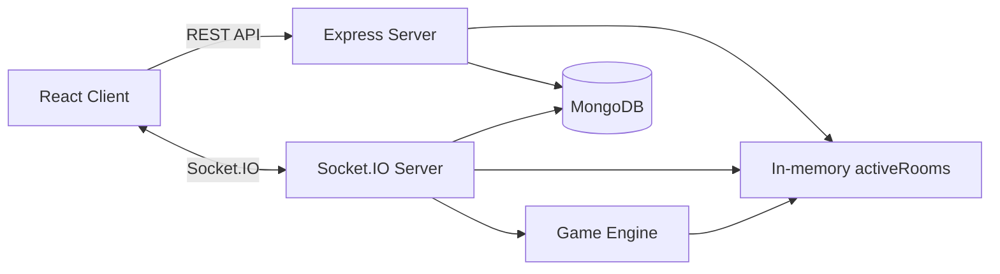

# Monopoly

Richup-style online multiplayer Monopoly for the browser. Create a room, pick a token, invite friends, negotiate trades, run auctions, build houses, mortgage properties, and play on built-in or custom maps without accounts.

Owned and maintained by [Aman Kumar](https://github.com/amanbotx2-fr).

> Production frontend URL: TODO<br>
> Production API URL: `https://monopoly-typeshit.onrender.com`

## Highlights

- Real-time multiplayer rooms powered by Socket.IO
- Anonymous guest sessions with no login or registration
- Built-in boards: World Tour, Classic USA, and World Capitals
- Custom map builder with private/public maps, duplication, editing, and publishing
- Lobby rules for starting cash, salary, jail rules, auctions, free parking, and turn order
- Auctions, trading, mortgages, houses, hotels, jail cards, bankruptcy, and victory detection
- In-game chat, action log, sound effects, responsive board UI, and mobile-friendly layouts
- MongoDB persistence for custom boards and periodic game snapshots
- Server-side session identity, payload validation, room cleanup, abuse protection, and rate limiting

## Screens

Add screenshots here before publishing the repository:

```text
TODO: Add home/lobby screenshot.
TODO: Add gameplay screenshot.
TODO: Add custom map builder screenshot.
```

## Tech Stack

| Layer | Technology |
| --- | --- |
| Frontend | React 19, Create React App, React Router, Socket.IO Client, lucide-react, Howler |
| Backend | Node.js, Express 5, Socket.IO, express-session |
| Database | MongoDB, Mongoose |
| Runtime State | In-memory active rooms with periodic MongoDB snapshots |
| Deployment | Backend on Render, frontend on Vercel or Render Static Site |

## Repository Structure

```text
.
|-- client/                 # React frontend
|   |-- src/components/     # Home, lobby, game, and editor UI
|   |-- src/api.js          # REST API client
|   |-- src/socket.js       # Socket.IO client singleton
|   `-- src/config.js       # REACT_APP_API_URL handling
|-- server/                 # Express + Socket.IO backend
|   |-- abuse/              # Rate limiting and pending-room cleanup
|   |-- game/               # Board definitions and game engine modules
|   |-- middleware/         # Session identity middleware
|   |-- models/             # Mongoose models
|   |-- routes/             # REST routes
|   |-- socket/             # Socket.IO event handlers
|   `-- validation/         # Server-side payload validation
|-- deploy/                 # Self-hosting deployment templates
`-- *.md                    # Audit and implementation reports
```

## Architecture



The backend is authoritative. The frontend renders state and sends intents; the server validates payloads, checks session identity, mutates game state, and broadcasts updated room snapshots.

## Gameplay Features

### Multiplayer

- Create or join rooms by six-character room code
- Host-controlled lobby and game start
- Spectator support after a game has started
- Reconnect support backed by server-side anonymous sessions
- Automatic cleanup for empty or abandoned rooms

### Game Engine

- Turn order, dice rolling, doubles, jail, GO salary, taxes, cards, free parking
- Property ownership, rent, color groups, stations, utilities
- Buying, auctions, mortgages, unmortgaging, building, selling buildings
- Trading with cash, properties, and jail cards
- Bankruptcy and end-game detection

### Custom Maps

- Create maps from blank or built-in templates
- Edit tile names, prices, rents, groups, taxes, stations, utilities, and special tiles
- Save maps as `CustomBoard` documents
- Manage maps from the My Maps page
- Publish, unpublish, duplicate, rename, delete, and edit maps

## Local Development

### Prerequisites

- Node.js 18+
- npm
- MongoDB running locally or a MongoDB connection string

### 1. Start the backend

```bash
cd server
npm install
cp .env.example .env
npm start
```

Default backend URL:

```text
http://localhost:5004
```

Minimum backend `.env`:

```env
MONGODB_URI=mongodb://localhost:27017/monopoly
CLIENT_URL=http://localhost:3000
PORT=5004
SESSION_SECRET=change-me
ROOM_IDLE_TIMEOUT_MS=900000
```

### 2. Start the frontend

```bash
cd client
npm install
cp .env.example .env
npm start
```

Default frontend URL:

```text
http://localhost:3000
```

For local development, `REACT_APP_API_URL` may be omitted because the frontend defaults to `http://localhost:5004`.

## Environment Variables

### Frontend

| Variable | Required | Description |
| --- | --- | --- |
| `REACT_APP_API_URL` | Production | Backend base URL used by REST and Socket.IO |

Example:

```env
REACT_APP_API_URL=https://monopoly-typeshit.onrender.com
```

### Backend

| Variable | Required | Description |
| --- | --- | --- |
| `MONGODB_URI` | Yes | MongoDB connection string |
| `CLIENT_URL` | Yes | Allowed frontend origin for CORS and Socket.IO |
| `PORT` | No | Backend port, defaults to `5004` |
| `SESSION_SECRET` | Production | Long random secret for signed session cookies |
| `ROOM_IDLE_TIMEOUT_MS` | No | Idle in-progress room cleanup timeout |
| `PENDING_HOST_CONNECT_MS` | No | Cleanup timeout for rooms whose host never connects |
| `MAX_ACTIVE_ROOMS` | No | Global in-memory room cap |
| `PENDING_ROOMS_PER_SESSION` | No | Pending room cap per anonymous session |

The backend also supports optional rate-limit environment variables such as:

```env
RATE_LIMIT_ROOM_CREATE_SESSION_PER_MIN=5
RATE_LIMIT_ROOM_CREATE_IP_PER_10_MIN=30
RATE_LIMIT_BOARD_MUTATE_PER_MIN=30
RATE_LIMIT_LOOKUP_PER_MIN=180
RATE_LIMIT_SOCKET_CONNECT_PER_MIN=30
RATE_LIMIT_SOCKET_CHAT_PER_10_SEC=8
RATE_LIMIT_SOCKET_AUCTION_BID_PER_10_SEC=20
RATE_LIMIT_SOCKET_TRADE_MSG_PER_10_SEC=10
```

## Deployment

This repository supports a split deployment:

- Backend: Render Web Service
- Frontend: Vercel or Render Static Site
- Database: MongoDB Atlas or another MongoDB deployment

### Render backend

Set these Render environment variables:

```env
MONGODB_URI=TODO
CLIENT_URL=TODO_FRONTEND_URL
SESSION_SECRET=TODO_LONG_RANDOM_SECRET
NODE_ENV=production
PORT=5004
```

### Vercel frontend

Set this Vercel environment variable:

```env
REACT_APP_API_URL=https://monopoly-typeshit.onrender.com
```

Then build the frontend with:

```bash
cd client
npm run build
```

Self-hosting templates are available in [deploy/](deploy/README.md).

## API Overview

Primary REST endpoints:

| Method | Path | Purpose |
| --- | --- | --- |
| `GET` | `/api/me` | Create/read anonymous session identity |
| `GET` | `/api/tokens` | List token colors |
| `GET` | `/api/boards` | List built-in, owned, and public boards |
| `GET` | `/api/boards/:id` | Load a board |
| `POST` | `/api/boards` | Create a custom board |
| `PATCH` | `/api/boards/:id` | Update an owned custom board |
| `DELETE` | `/api/boards/:id` | Delete an owned custom board |
| `POST` | `/api/boards/:id/duplicate` | Duplicate a board |
| `POST` | `/api/rooms` | Create a room |
| `GET` | `/api/rooms` | List open rooms |
| `GET` | `/api/rooms/:code` | Preview a room |

Primary Socket.IO events:

```text
chat
set-color
set-username
update-rules
kick
start-game
roll
buy
decline-buy
end-turn
jail-pay
jail-card
mortgage
unmortgage
build
demolish
auction-bid
auction-pass
trade-propose
trade-update
trade-accept
trade-reject
trade-msg
bankrupt
```

## Security and Reliability

Implemented backend protections include:

- Server-side anonymous session identity with `express-session`
- Socket.IO identity from the same server session
- Strict REST and Socket.IO payload validation
- Structured validation and rate-limit errors
- CORS restricted by `CLIENT_URL`
- Socket and REST abuse protection
- Idle room cleanup and pending-host cleanup
- Autosave lifecycle management for active game rooms

## Development Notes

- Built-in boards live in `server/game/boards.js`.
- The game engine lives in `server/game/engine.js`.
- Property actions live in `server/game/property.js`.
- Auctions live in `server/game/auction.js`.
- Trades live in `server/game/trade.js`.
- Socket event wiring lives in `server/socket/handlers.js`.
- Custom board persistence is defined in `server/models/CustomBoard.js`.

## Project Status

This is an active multiplayer game project. The core gameplay loop, custom map builder, session identity, validation, rate limiting, and deployment compatibility have been implemented. Before a public production launch, add final screenshots, a production frontend URL, a license, and production observability.

## Maintainer

**Aman Kumar**<br>
GitHub: [amanbotx2-fr](https://github.com/amanbotx2-fr)

## License

TODO: Add a license file before publishing or accepting external contributions.


okay we need to do more