# MONOPOLY

Real-time multiplayer MONOPOLY for the web: rooms, live lobbies, custom boards,
trades, auctions, spectators, and a server-authoritative game engine.


MONOPOLY is an open-source, browser-based multiplayer board-game platform. It
keeps the familiar flow of property trading, rent, auctions, mortgages, jail,
and bankruptcy while adding real-time rooms, anonymous guest sessions, spectator
support, and a custom map builder.

This repository is an independent open-source project and is not affiliated
with Hasbro or any official Monopoly product.

## Screenshots

| Home                                 | Lobby Host                                | Lobby Guest                                 |
| ------------------------------------ | ----------------------------------------- | ------------------------------------------- |
| 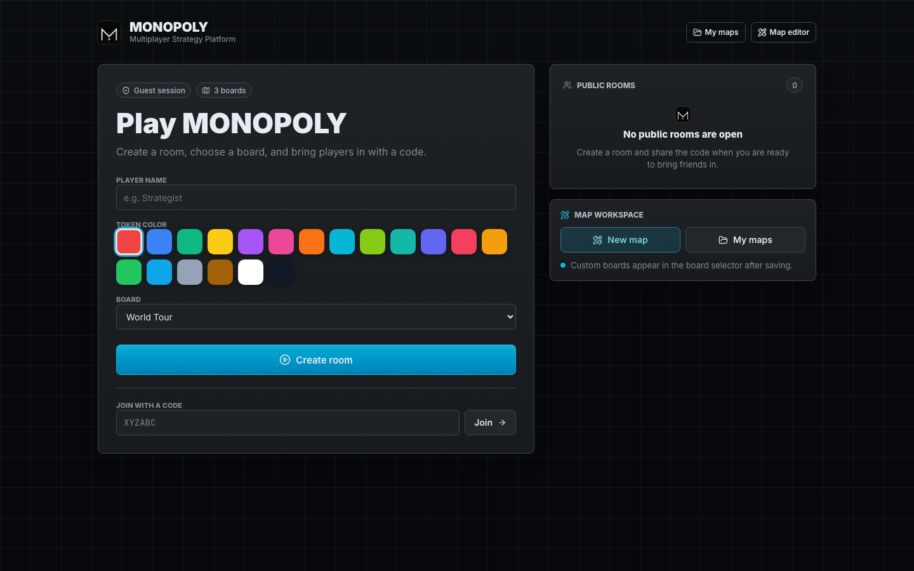 | 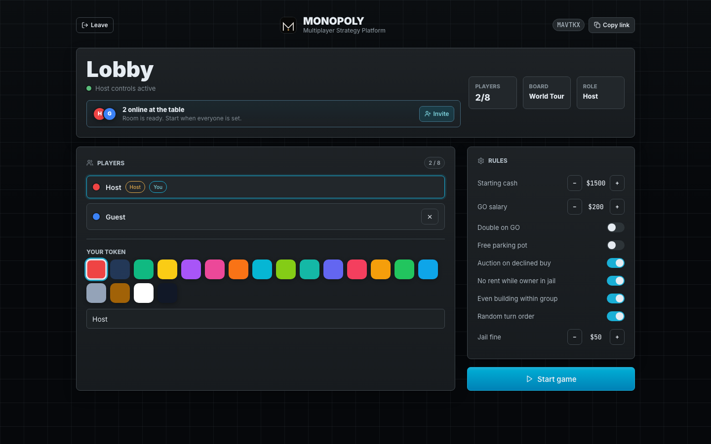 | 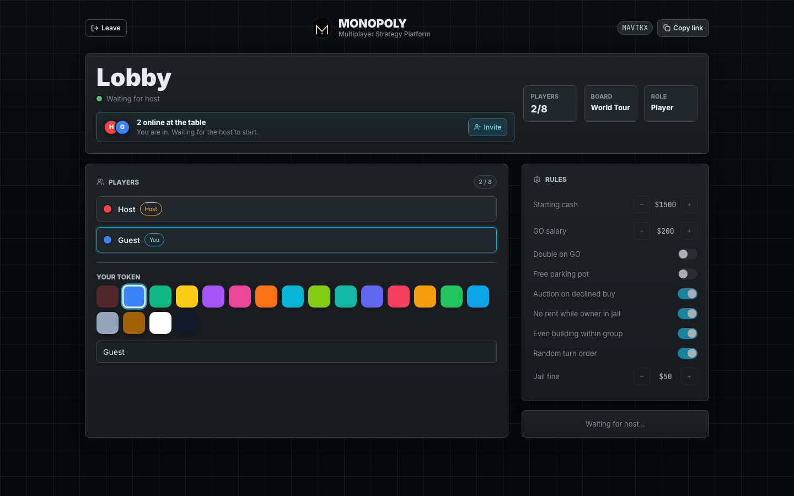 |

| Active Game                          | Property                                    |
| ------------------------------------ | ------------------------------------------- |
| 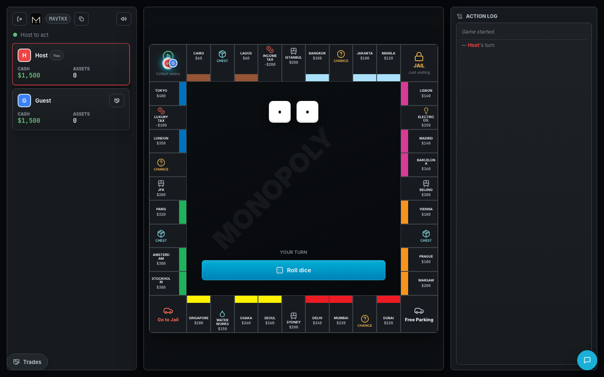 | 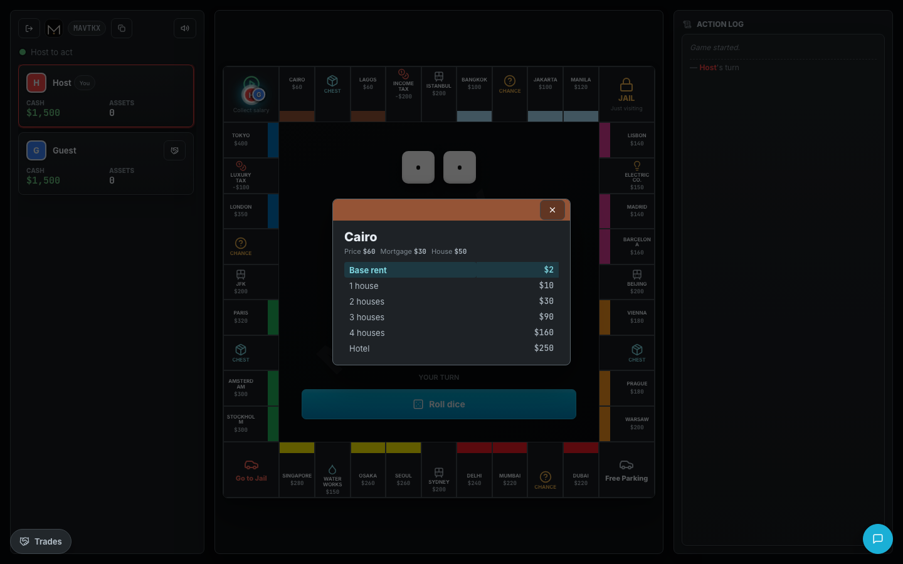 |

| Auction                                   | Trade                                 | Chat                                 |
| ----------------------------------------- | ------------------------------------- | ------------------------------------ |
| 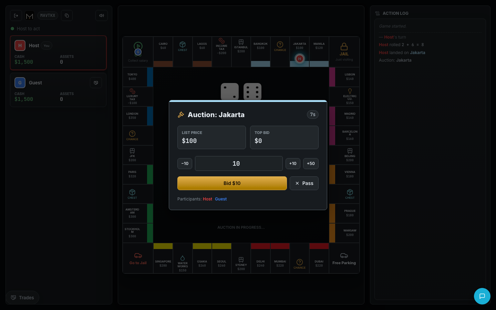 | 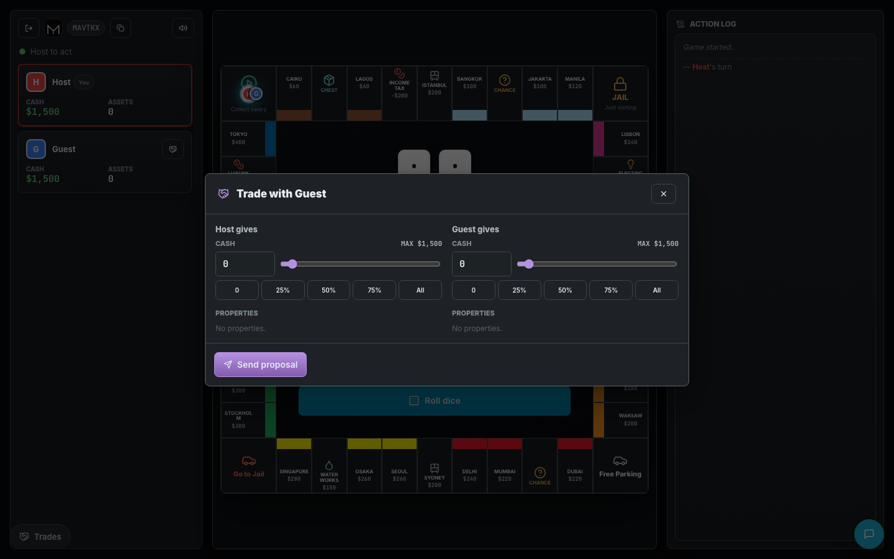 | 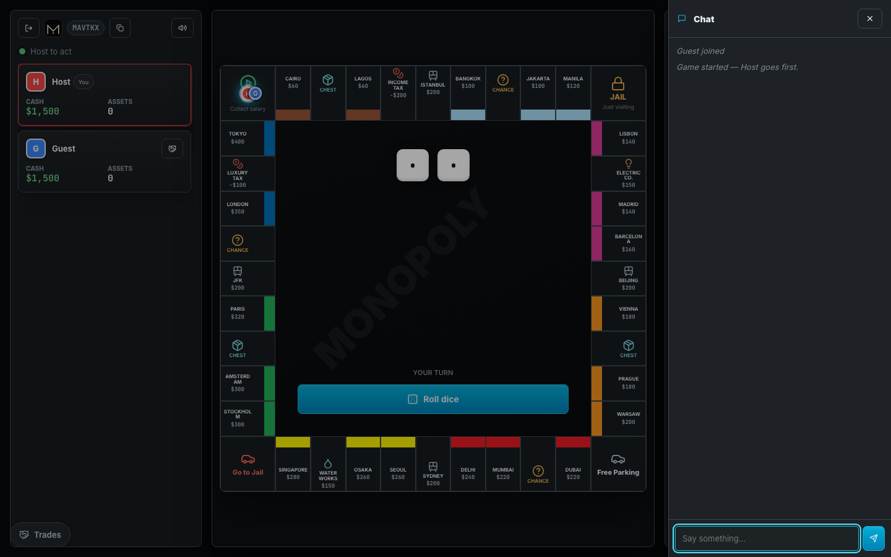 |

| Map Builder                             | My Maps                          |
| --------------------------------------- | -------------------------------- |
| 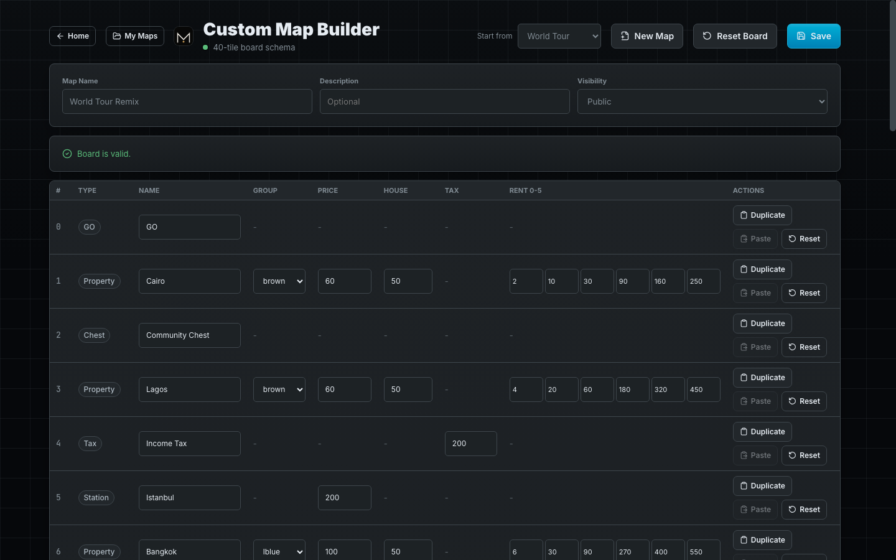 | 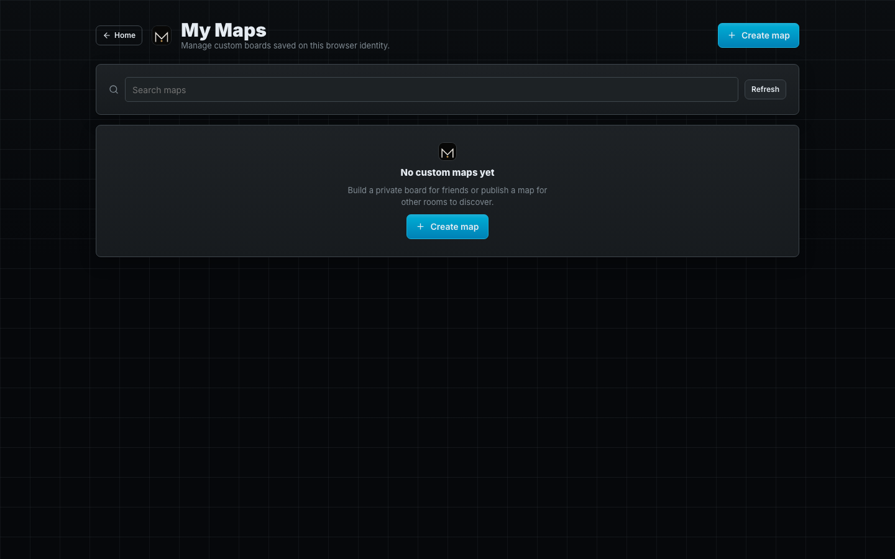 |

| Mobile Home                                 | Mobile Lobby                                  | Mobile Game                                 |
| ------------------------------------------- | --------------------------------------------- | ------------------------------------------- |
| 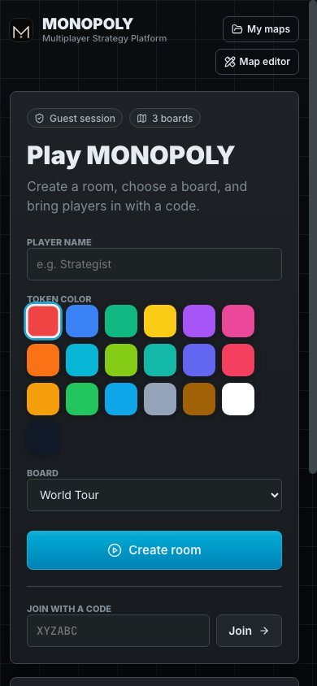 | 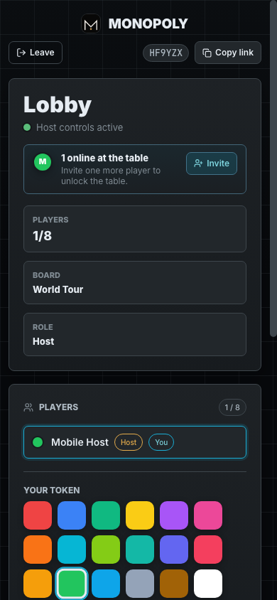 | 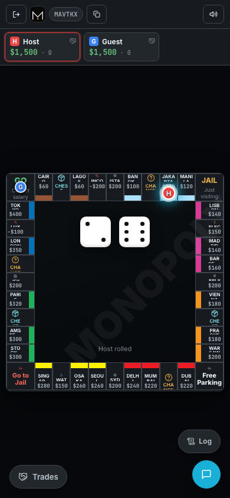 |

## Features

| Area                | What is included                                                                            |
| ------------------- | ------------------------------------------------------------------------------------------- |
| Multiplayer rooms   | Create rooms, join by code, browse public rooms, host controls, spectator flow.             |
| Realtime sync       | Socket.IO state broadcasts for lobby, turns, auctions, trades, chat, and game events.       |
| Guest sessions      | Anonymous server-side sessions with no accounts, login screens, or JWTs.                    |
| Game engine         | Turn order, dice, movement, rent, jail, property ownership, cards, bankruptcy, and victory. |
| Auctions            | Server-side auction state, bids, passes, timers, and final transfer.                        |
| Trading             | Player-to-player proposals, cash/property exchange, messages, accept/reject/edit flows.     |
| Property management | Buy, mortgage, unmortgage, build houses, sell houses, inspect ownership and rents.          |
| Custom boards       | Built-in boards plus saved custom boards that appear in room creation.                      |
| Map builder         | New maps from blank or templates, tile editing, drafts, validation, publish/unpublish.      |
| Abuse protection    | Payload validation, REST rate limits, Socket.IO throttles, and idle-room cleanup.           |
| Responsive UI       | Desktop, tablet, and mobile layouts with dark-first design tokens.                          |
| Audio               | Lightweight procedural sound effects with persisted mute and volume settings.               |

## Tech Stack

| Layer      | Stack                                                                     |
| ---------- | ------------------------------------------------------------------------- |
| Frontend   | React 19, Vite, React Router, lucide-react, CSS design tokens.            |
| Backend    | Node.js 20+, Express 5, Socket.IO 4, express-session.                     |
| Database   | MongoDB through Mongoose for custom boards and saved room snapshots.      |
| Realtime   | Socket.IO rooms with server-owned game state and session-backed identity. |
| Deployment | Separate frontend/backend deployment or same-origin nginx reverse proxy.  |

## Project Structure

```text
.
├── client/
│   ├── index.html              # Vite HTML entrypoint
│   ├── public/                 # Static assets, favicon, PWA manifest, brand assets
│   ├── src/
│   │   ├── components/common/   # Brand logo and shared UI helpers
│   │   ├── components/editor/   # Map builder and My Maps screens
│   │   ├── components/game/     # Board, modals, panels, chat, auctions, trades
│   │   ├── components/home/     # Home screen and token picker
│   │   ├── components/lobby/    # Lobby, rules, players, host controls
│   │   ├── api.js               # REST client with credentials
│   │   ├── socket.js            # Socket.IO client
│   │   ├── theme.css            # Design tokens and shared styles
│   │   └── useRoom.js           # Room/socket state hook
│   └── package.json
├── server/
│   ├── abuse/                   # REST and Socket.IO rate limiting
│   ├── game/                    # Server-authoritative game engine
│   ├── middleware/              # Session middleware shared by Express and Socket.IO
│   ├── models/                  # Mongoose models
│   ├── routes/                  # REST endpoints
│   ├── socket/                  # Socket.IO event handlers and room lifecycle
│   ├── validation/              # Strict payload validators
│   └── index.js                 # Express and Socket.IO entrypoint
├── deploy/                      # Optional nginx/systemd deployment templates
├── docs/                        # Roadmap, design system, and README screenshots
└── LICENSE
```

## Installation

### Prerequisites

- Node.js 20 or newer
- npm
- MongoDB running locally or a MongoDB connection string

### 1. Clone the repository

```bash
git clone https://github.com/amanbotx2-fr/Monopoly-main.git
cd Monopoly-main
```

### 2. Install backend dependencies

```bash
cd server
npm install
cp .env.example .env
```

Edit `server/.env` if your MongoDB instance is not running at
`mongodb://localhost:27017/monopoly`.

### 3. Install frontend dependencies

```bash
cd ../client
npm install
cp .env.example .env.local
```

For local development, the default frontend API URL is already
`http://localhost:5004`.

### 4. Start MongoDB

Use your local MongoDB service, Docker, MongoDB Atlas, or any compatible
connection string. A local service usually works with:

```bash
mongod --dbpath ./mongo-data
```

If you use a managed database, set `MONGODB_URI` in `server/.env`.

### 5. Start the backend

```bash
cd server
npm start
```

The backend listens on `http://localhost:5004`.

### 6. Start the frontend

Open a second terminal:

```bash
cd client
npm start
```

Visit `http://localhost:3000`.

## Environment Variables

### Frontend

| Variable       | Required | Default                 | Description                                                                        |
| -------------- | -------- | ----------------------- | ---------------------------------------------------------------------------------- |
| `VITE_API_URL` | No       | `http://localhost:5004` | Express and Socket.IO backend URL. Vite exposes variables with the `VITE_` prefix. |

### Backend

| Variable                    | Required          | Default                              | Description                                                               |
| --------------------------- | ----------------- | ------------------------------------ | ------------------------------------------------------------------------- |
| `MONGODB_URI`               | No                | `mongodb://localhost:27017/monopoly` | MongoDB connection string.                                                |
| `CLIENT_URL`                | No                | `http://localhost:3000`              | Allowed browser origin for CORS and Socket.IO credentials.                |
| `PORT`                      | No                | `5004`                               | Backend HTTP port.                                                        |
| `SESSION_SECRET`            | Yes in production | development fallback                 | Secret used to sign anonymous session cookies. Use a long random value.   |
| `ROOM_IDLE_TIMEOUT_MS`      | No                | `900000`                             | How long an empty started room can remain before cleanup.                 |
| `PENDING_HOST_CONNECT_MS`   | No                | `300000`                             | Grace period for a newly created room before the host connects by socket. |
| `PENDING_ROOMS_PER_SESSION` | No                | `2`                                  | Number of pending rooms one session can create.                           |
| `MAX_ACTIVE_ROOMS`          | No                | `200`                                | Hard cap for in-memory active rooms.                                      |
| `RATE_LIMIT_*`              | No                | See `server/.env.example`            | REST and Socket.IO abuse-protection tuning.                               |

## Gameplay

Players create a room, choose a board, invite others with a room code, tune
rules, and start from the lobby. The backend owns the game state and accepts only
validated actions from room members.

The built-in flow includes:

- Dice rolling and turn enforcement.
- Property purchase, ownership, rent, and group monopolies.
- Houses, hotels, mortgage, unmortgage, and house sales.
- Chance and Community Chest decks.
- Jail, paying fines, doubles, and jail-free cards.
- Auctions when a property is skipped.
- Trade proposals with cash, properties, and messages.
- Bankruptcy resolution and end-game detection.
- Spectators who can watch without becoming players.

## Custom Boards

The board system supports:

- Built-in boards: Classic USA, World Tour, and World Capitals.
- Saved custom boards in MongoDB.
- Public/private visibility.
- Duplicate, rename, delete, publish, and unpublish workflows.
- Blank-board generation that remains compatible with the game engine.

Saved custom boards are returned by `GET /api/boards`, so they automatically
appear in the Home board selector without restarting the server.

## Architecture

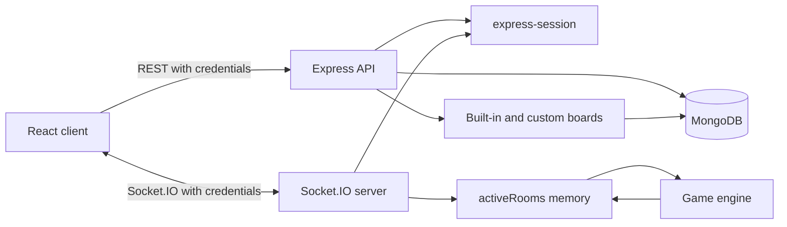

Key points:

- Express and Socket.IO share the same session middleware.
- The client never chooses its own identity; identity comes from the server
  session.
- REST routes handle room creation, board CRUD, public room listing, and health.
- Socket.IO handles lobby sync, gameplay actions, chat, trades, auctions, and
  reconnect behavior.
- Active rooms are kept in memory and periodically saved to MongoDB.
- Production deployments use Mongo-backed sessions and require
  `SESSION_STORE_MONGODB_URI` or `MONGODB_URI` so `MemoryStore` is never used
  outside local development.

## Deployment

The frontend and backend can be deployed separately:

```bash
# frontend build environment
VITE_API_URL=https://api.example.com

# backend environment
CLIENT_URL=https://app.example.com
NODE_ENV=production
SESSION_SECRET=replace-with-a-long-random-secret
MONGODB_URI=mongodb+srv://...
```

For same-origin self-hosting, see the nginx and systemd templates in
[`deploy/`](deploy/README.md).

## Development Notes

- The client is a Vite project.
- The backend is a plain Express app with Socket.IO mounted on the same HTTP
  server.
- There is no account system and no JWT flow.
- MongoDB is required for custom boards and saved room snapshots.
- The default `express-session` MemoryStore is suitable for local development
  only. Use Redis, Mongo-backed sessions, or another shared store in production.

## Roadmap

See [`docs/ROADMAP.md`](docs/ROADMAP.md) for post-v1.0 work. High-priority
areas include automated multiplayer tests, durable room recovery, production
session storage, CSRF protection for REST mutations, and CI.

## Contributing

Contributions are welcome. Good first areas include documentation, accessibility
improvements, test coverage, map-builder validation, and small UI refinements.

Before opening a pull request:

1. Keep gameplay-rule changes focused and documented.
2. Run `npm install` in both `client/` and `server/`.
3. Run `npm run build` in `client/`.
4. Manually verify create/join room, lobby, game start, chat, trade, auction,
   property actions, map builder, and My Maps.
5. Do not commit `.env`, build output, logs, or local database files.

## License

MIT. See [`LICENSE`](LICENSE).
