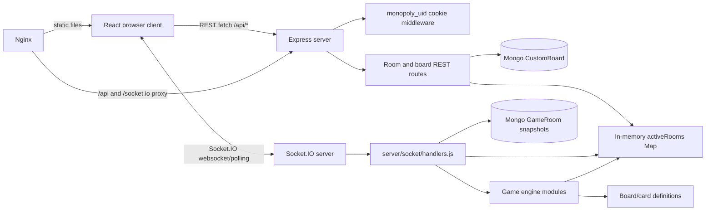
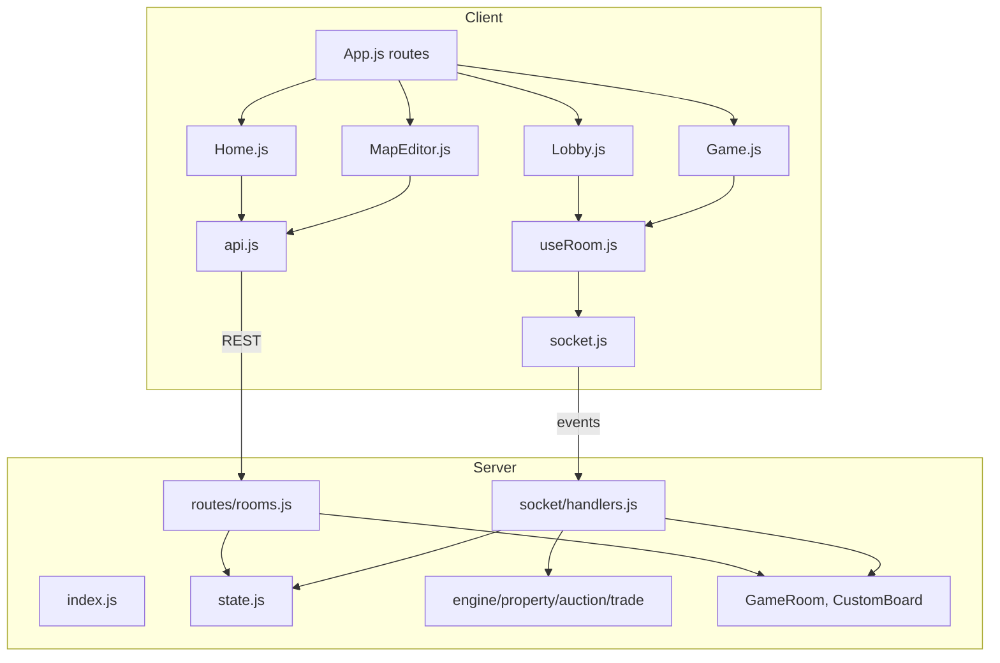
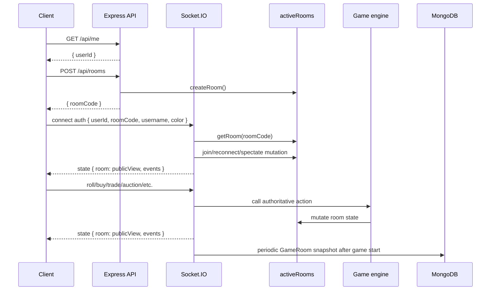
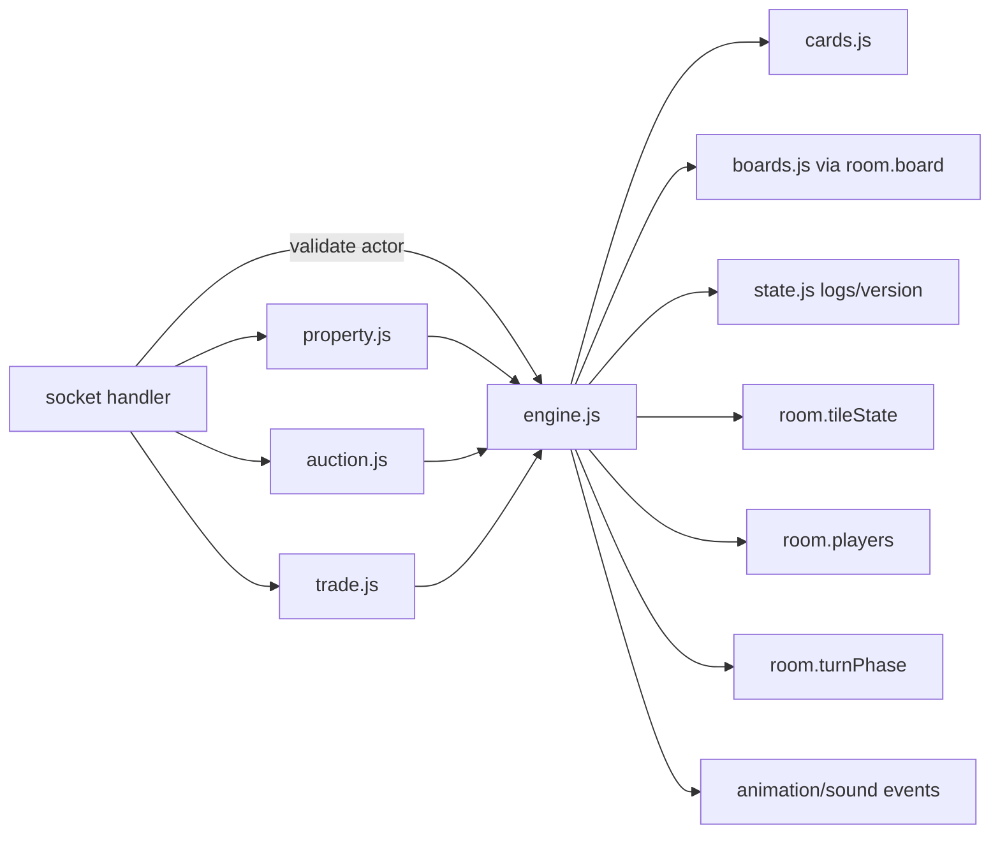

# Acquisition-Grade Technical Due Diligence Report

Repository: `Monopoly-main`  
Maintainer after rebrand: Aman Kumar (https://github.com/amanbotx2-fr)  
Audit date: 2026-06-25  
Scope: full local repository audit, including source, manifests, lockfiles, public assets, environment examples, deployment files, REST routes, Socket.IO events, game engine modules, database models, and frontend flows.  
External comparison source: Richup.io public landing page, https://richup.io/, accessed during audit.

## 1. Executive Summary

This repository is a working prototype of a Richup-style browser Monopoly game. It has a React client, a Node/Express/Socket.IO backend, MongoDB models for snapshots and custom boards, and a server-authoritative in-memory game engine. The product surface is broader than a toy implementation: lobbies, open rooms, custom board editing, auctions, trades, mortgages, houses/hotels, jail cards, chat, sound, responsive board UI, action logs, and deployment instructions are all present.

The architecture is simple and understandable, but it is not acquisition-ready as production multiplayer infrastructure. The core game is concentrated in a few modules and can be salvaged, but the security model, persistence story, custom board path, rule correctness, test coverage, and deployment maturity need significant work.

Audit counts:

| Metric | Count |
|---|---:|
| Total files analyzed | 77 |
| Application source files analyzed | 51 (`49` JS + `2` CSS; public HTML shell also inspected) |
| Socket handlers found | 25 registered handlers including `disconnect`; 24 custom inbound app/game events |
| Database models found | 2 |
| Game-engine files found | 7 |

Highest-risk findings:

| Severity | Finding | Evidence |
|---|---|---|
| Critical | Socket identity can be spoofed because the server trusts `socket.handshake.auth.userId`; all room users can see other `userId` values in public state. | `server/socket/handlers.js`, `client/src/socket.js`, `server/game/state.js` |
| Critical | Community/custom board creation path is broken from the UI: `Home` sends `boardId`, but the backend only loads custom boards from `customBoardId`. | `client/src/components/home/Home.js`, `server/routes/rooms.js` |
| High | Custom boards do not compute/store `groupSizes`, so full-set ownership and building rules break for custom boards even if room creation is fixed. | `server/game/state.js`, `server/models/CustomBoard.js`, `server/game/boards.js` |
| High | Debt handling is incomplete. Several money flows ignore failed transfers, allowing players to avoid payment or continue after insufficient funds. | `server/game/engine.js` |
| High | Bankruptcy can be invoked by any player at any time through the socket handler, not only while resolving debt, with arbitrary creditor transfer. | `server/socket/handlers.js`, `server/game/engine.js` |
| High | Persistence is one-way autosave only; no startup reload or recovery path exists despite `GameRoom` comments. | `server/socket/handlers.js`, `server/models/GameRoom.js` |
| High | No automated tests exist for game rules, socket authorization, REST APIs, or frontend flows. | Repository-wide |
| High | Dependency audit found 55 client advisories and 6 server advisories from current lockfiles. | `client/package-lock.json`, `server/package-lock.json`, `npm audit` |

Verdict: the repository is a strong MVP/prototype and a useful starting point for a Richup-like game, but it should not be valued as a production-ready multiplayer platform. Estimated readiness for production Richup-style gameplay is roughly 45% reusable, 35% refactor, 20% rewrite.

## 2. Repository Structure

Top-level structure:

```text
.
|-- README.md
|-- client/
|   |-- package.json
|   |-- package-lock.json
|   |-- public/
|   |   |-- index.html
|   |   |-- manifest.webmanifest
|   |   |-- favicon*.svg
|   |   `-- icon/apple-touch PNG assets
|   `-- src/
|       |-- index.js
|       |-- App.js
|       |-- api.js
|       |-- socket.js
|       |-- useRoom.js
|       |-- sound.js
|       |-- theme.css
|       `-- components/
|           |-- home/
|           |-- lobby/
|           |-- editor/
|           |-- common/
|           `-- game/
|-- server/
|   |-- package.json
|   |-- package-lock.json
|   |-- .env.example
|   |-- index.js
|   |-- middleware/session.js
|   |-- routes/rooms.js
|   |-- socket/handlers.js
|   |-- models/
|   |   |-- CustomBoard.js
|   |   `-- GameRoom.js
|   `-- game/
|       |-- state.js
|       |-- engine.js
|       |-- boards.js
|       |-- cards.js
|       |-- property.js
|       |-- auction.js
|       `-- trade.js
`-- deploy/
    |-- README.md
    |-- monopoly.nginx.conf
    |-- monopoly-server.service
    `-- push.sh
```

Not present:

| Area | Status |
|---|---|
| Root `package.json` | Missing |
| Dockerfile / Compose | Missing |
| CI/CD workflows | Missing |
| Test files | Missing |
| TypeScript config | Missing |
| Runtime observability config | Missing |
| API documentation / schema | Missing |

Important structure notes:

- `client/src/components/game/` contains the majority of frontend complexity and board-specific UI.
- `server/game/` is the core authoritative domain layer. It is not purely functional; it mutates in-memory room objects.
- `server/socket/handlers.js` is the real-time application controller.
- `server/routes/rooms.js` handles pre-game REST flows: board listing/saving, room creation, room preview, token list.
- `deploy/README.md` previously referenced a separate API nginx file; after rebranding, deployment domains are TODO placeholders until Aman Kumar sets production domains.

## 3. Architecture Overview

### High-Level Architecture



The system uses a classic single-node authoritative game server. HTTP creates rooms and stores identity cookies. Socket.IO joins the room and drives all live state. MongoDB is intended for snapshots and custom board persistence, but live game state is the in-memory `activeRooms` Map.

### Frontend/Backend Relationship



### Socket Communication Flow



### Game Engine Interaction



Architectural patterns:

- Server-authoritative state machine: clients request actions; server mutates and broadcasts.
- Snapshot broadcasting: every state-changing socket event broadcasts full `publicView(room)` plus event hints.
- Modular domain files: `engine.js` for core movement/rent/turns/cards/bankruptcy, `property.js` for build/mortgage, `auction.js`, `trade.js`, `boards.js`, `cards.js`.
- Denormalized ownership: ownership exists in both `room.tileState[pos].owner` and `player.owned`.
- No-account identity: user identity is a durable cookie plus client-provided socket auth.

Key architectural risks:

- In-memory `activeRooms` prevents horizontal scaling and loses live state on crash.
- Mongo snapshot writes exist, but startup restoration is not implemented.
- Socket auth is not bound to the HTTP cookie.
- Domain methods are mutative and not wrapped in transactions/commands.
- No test harness exists around the state machine.

## 4. Technology Stack Audit

### Client

| Component | Package | Resolved Version | Notes |
|---|---|---:|---|
| UI framework | `react`, `react-dom` | 19.2.5 | Modern React version, but paired with old CRA tooling. |
| Router | `react-router-dom` | 7.14.1 | Direct dependency with high advisories in audit. |
| Build tooling | `react-scripts` | 5.0.1 | Stale Create React App stack; major source of advisories. |
| Realtime client | `socket.io-client` | 4.8.3 | Matches server Socket.IO major. |
| Icons | `lucide-react` | 0.400.0 | Used heavily. |
| Audio | Web Audio API; `howler` dep present | 2.2.4 | `howler` is unused. |
| Drag/drop | `@dnd-kit/core`, `@dnd-kit/utilities` | 6.3.1 / 3.2.2 | Present but unused in current editor. |

Client audit result:

- `npm audit --json` reported 55 vulnerabilities: 1 critical, 17 high, 32 moderate, 5 low.
- Direct high-risk packages include `react-router-dom` via `react-router` and `react-scripts`.
- Most CRA advisories are in build/dev transitive dependencies, but `react-router-dom` is a runtime dependency and should be upgraded.
- No client tests are present.
- No TypeScript, schema validation, or generated API client is present.

### Server

| Component | Package | Resolved Version | Notes |
|---|---|---:|---|
| Runtime | Node.js | README says 18+; deploy unit uses Node 22.22.2 | No `.nvmrc` or engines field. |
| HTTP | `express` | 5.2.1 | Modern Express 5. |
| Realtime | `socket.io` | 4.8.3 | In-memory adapter only. |
| Database | `mongoose` | 9.4.1 | Used for snapshots and custom boards. |
| Cookies | `cookie-parser` | 1.4.7 | Used by session middleware. |
| CORS | `cors` | 2.8.6 | Single configured origin. |
| Env | `dotenv` | 17.4.2 | Standard. |
| IDs | `uuid` | 13.0.0 | Used through CommonJS `require`; runtime was not installed during audit, so compatibility should be smoke-tested after install. |

Server audit result:

- `npm audit --json` reported 6 vulnerabilities: 1 high, 5 moderate.
- Notable advisories: `ws` through Socket.IO stack, `uuid@13.0.0`, `qs`, `engine.io`.
- No test runner or lint script exists.
- No health check beyond `/api/health`.
- `SESSION_SECRET` exists in `.env.example` but is unused because there is no signed session.

### Deployment

| File | Role | Finding |
|---|---|---|
| `deploy/monopoly.nginx.conf` | Static client plus `/api` and `/socket.io` reverse proxy | Reasonable single-domain deployment. |
| `deploy/monopoly-server.service` | systemd unit | Hardcodes user/path/Node binary; no sandboxing/hardening options. |
| `deploy/push.sh` | Manual rsync deployment | Builds client locally, syncs server/client, remote `npm install --omit=dev`, restarts systemd. |
| `deploy/README.md` | Manual deployment notes | References missing `monopoly-api.nginx.conf`. |

No Docker, CI, IaC, blue/green deploy, migrations, monitoring, log rotation config, or rollback mechanism is present.

## 5. Frontend Analysis

### Entry and Routing

- `client/src/index.js` mounts React into `#root` and wraps `App` in `BrowserRouter`.
- `client/src/App.js` fetches `/api/me`, installs global click sound, registers socket error toasts, and routes:
  - `/` -> `Home`
  - `/r/:code` -> `RoomRouter`, which switches between `Lobby` and `Game`
  - `/editor` -> `MapEditor`

Risk: `RoomRouter` stores phase locally, so a direct visit to a started room first mounts `Lobby`, then switches to `Game` after the first room state arrives. This works but causes an unnecessary socket lifecycle transition when the host starts the game: `Lobby` unmounts and `Game` reconnects.

### API Client

- `client/src/api.js` uses `fetch` with `credentials: 'include'`.
- `REACT_APP_API_URL` can override API base.
- Error handling extracts `json.error` when possible.

Mismatch: `client/src/components/lobby/Lobby.js` bypasses `api.js` and calls `fetch('/api/tokens')` directly. This breaks deployments where `REACT_APP_API_URL` points to a separate API host.

### Socket Client and Room Hook

- `client/src/socket.js` creates a singleton Socket.IO client keyed only by `roomCode`.
- `client/src/useRoom.js` connects with `{ userId, roomCode, username, color }`, subscribes to `state` and `chat`, plays sounds for incoming event batches, and exposes `act(event, payload)`.

Strengths:

- UI components do not mutate game state directly.
- Socket interaction is centralized.
- Full room snapshots make reconnect behavior simple.

Risks:

- Client sends `userId` in socket auth. Server trusts it.
- Socket singleton ignores `userId` changes for the same room.
- Full snapshots include all `userId` values, making spoofing easier.
- Event version tracking suppresses duplicate playback, but there is no client-initiated resync despite comments about detecting missed deltas.

### Home and Lobby

- `Home` supports username/color persistence, room creation, room joining, open room polling, board selection, and map editor navigation.
- `Lobby` shows players, token selection, username update, kick, rules, and start game.

Critical product bug:

- Community boards are listed in `Home`, but room creation sends `{ username, color, boardId }`.
- `server/routes/rooms.js` only loads custom boards when `customBoardId` is present.
- Result: selecting a community board likely throws `Unknown board` in `createRoom()`.

Rules UI exposes only a subset of server rules:

| Rule | Server Exists | Lobby UI |
|---|---|---|
| `startingCash` | Yes | Yes |
| `salary` | Yes | Yes |
| `doubleOnGo` | Yes | Yes |
| `freeParkingPot` | Yes | Yes |
| `auctionUnbought` | Yes | Yes |
| `noRentInJail` | Yes | Yes |
| `evenBuild` | Yes | Yes |
| `randomTurnOrder` | Yes | Yes |
| `jailFine` | Yes | Yes |
| `mortgageRebuyRate` | Yes | No |
| `jailTurnsMax` | Yes | No |
| `xDoubles` | Yes | No |
| `turnClockSeconds` | Yes | No, and not implemented |
| `allowDevOnMortgaged` | Yes | No |

### Game UI

`client/src/components/game/Game.js` composes:

- `Board`
- `PlayerPanel` / `PlayerStrip`
- `ActionLog` / `LogDrawer`
- `ChatPanel`
- `TradesPanel`
- `CardModal`
- `AuctionModal`
- `TradeModal`
- `PropertyModal`
- `SoundToggle`
- `Victory`

Strengths:

- The UI is visually complete for MVP play.
- Desktop and mobile layouts exist.
- Board geometry is centralized in `layout.js`.
- Tile, token, overlay, dice, and modal components are separated well enough to extend.
- React escapes chat/user text, reducing XSS risk from normal rendering.

Risks and gaps:

- `client/src/components/game/Chat.js` is unused after `ChatPanel` replaced it.
- Trading UI does not allow selecting jail-free cards even though the backend supports trading them.
- Property management actions can be sent at any time; there is no clear turn-phase UX or server rule boundary around building/mortgaging.
- `Victory` only appears when server sets `room.ended`; server only checks victory during `endTurn`.
- UI references "live cursors" in `Home`, but no live cursor feature exists.
- The board layout comment in `layout.js` says GO is top-left, while `server/game/boards.js` comments describe GO as bottom-right. This is visual/documentation drift rather than a logic bug.

### Map Editor

`client/src/components/editor/MapEditor.js`:

- Loads a built-in board as a starter.
- Allows editing names, groups, prices, house costs, and rent arrays.
- Saves to `/api/boards`.
- Locks position and type.

Gaps:

- No author name is sent, so community board list can render `undefined` author.
- No private board UI despite `isPublic`.
- No validation preview beyond backend response.
- No ability to use the saved custom board due to the `boardId`/`customBoardId` mismatch.
- Backend does not compute `groupSizes` for saved custom boards.

### Styling and Assets

- `client/src/theme.css` defines global design tokens, buttons, cards, chips, animations, and background.
- `client/src/components/game/board.css` defines board geometry, tokens, dice, and overlay effects.
- Public assets are icon-only: SVG dice marks and PNG touch icons.

The UI has a coherent dark game-table style. From an acquisition perspective, the visual system is useful, but it is coupled to inline styles and CRA, so it would benefit from extraction into a design-system layer before major feature growth.

## 6. Backend Analysis

### HTTP Server

`server/index.js`:

- Loads env.
- Creates Express and HTTP server.
- Creates Socket.IO server with CORS credentials.
- Enables `trust proxy`.
- Adds CORS, JSON body limit of 5 MB, cookies, and no-account session middleware.
- Connects to MongoDB.
- Mounts `/api` routes.
- Adds `/api/health` and `/api/me`.
- Registers socket handlers.

Missing production middleware:

- No rate limiting.
- No request logging.
- No Helmet/security headers.
- No structured errors for route exceptions.
- No validation middleware.
- No metrics.

### Session Middleware

`server/middleware/session.js` creates a durable `monopoly_uid` cookie:

- `httpOnly: true`
- `sameSite: 'lax'`
- `secure` in production
- one-year max age

This is adequate as a lightweight anonymous identity for HTTP routes. The problem is that Socket.IO does not verify this cookie. Instead, the client asks `/api/me`, receives `userId`, then sends it in socket auth.

Required fix: parse and verify the cookie during Socket.IO handshake, set `socket.data.userId` from the cookie, and ignore any client-supplied `userId`.

### REST Routes

`server/routes/rooms.js`:

| Route | Purpose | Notes |
|---|---|---|
| `GET /api/boards` | Built-in and public community boards | Returns top 50 public custom boards. |
| `GET /api/boards/:id` | Built-in or custom board detail | Built-ins take precedence. |
| `POST /api/boards` | Save/upsert custom board | No ownership enforcement. |
| `POST /api/rooms` | Create room | Host becomes player 0. |
| `GET /api/rooms/:code` | Room preview | No full state leak. |
| `GET /api/rooms` | Open rooms | In-memory only; filters stale rooms older than 5 min. |
| `GET /api/tokens` | Token colors | Static list from state. |

Route risks:

- `POST /api/boards` allows upserting by arbitrary `id`; no check that `authorUserId` owns the existing board.
- `POST /api/boards` does not set `authorUsername`.
- Custom board validation is minimal.
- `POST /api/rooms` can throw on unknown `boardId`; no route-level `try/catch`.
- `publicView` is imported but unused.

### Socket Layer

`server/socket/handlers.js` is the main application controller:

- `onJoin` handles reconnects, new players, and spectators.
- `broadcast` increments version and emits full public state.
- `sysChat` emits system chat messages.
- A global interval checks open auctions every second.
- Each inbound event is wrapped by `safe()`.
- Game state snapshots save every 30 seconds after `start-game`.

Strengths:

- The dispatch table is easy to audit.
- Game logic is mostly delegated to `server/game/*`.
- Error events are consistently emitted as `error-msg`.

Risks:

- Socket identity is spoofable.
- No payload schema validation.
- No rate limits or flood controls.
- No room cleanup or `stopAutoSave` call.
- No recovery from `GameRoom` snapshots.
- `uuidv4` import is unused.
- `stripTransient` marks all players `connected: true` in snapshots, which would be misleading if restore were implemented.

## 7. Multiplayer System Analysis

### Socket Event Inventory

| Event | Sent By | Received By | Purpose |
|---|---|---|---|
| `connection` | Socket.IO client handshake | Server `io.on('connection')` | Establishes socket and immediately calls `onJoin`. |
| `state` | Server | All clients in room | Broadcasts full public room view plus event hints after mutations. |
| `chat` inbound | Client | Server | Sends player/spectator chat message. |
| `chat` outbound | Server | All clients in room | Broadcasts appended chat/system message. |
| `error-msg` | Server | Client | Reports validation/action/server errors. |
| `set-color` | Client | Server | Changes pre-game token color if available. |
| `set-username` | Client | Server | Renames player or spectator. |
| `update-rules` | Host client | Server | Updates allow-listed rules before start. |
| `kick` | Host client | Server | Removes non-host player before start. |
| `start-game` | Host client | Server | Starts game, sets first turn, begins autosave. |
| `roll` | Active player client | Server | Rolls dice and resolves movement/landing. |
| `buy` | Active player client | Server | Buys current unowned tile while in `buying` phase. |
| `decline-buy` | Active player client | Server | Declines current property; optionally starts auction. |
| `end-turn` | Active player client | Server | Advances to next non-bankrupt player. |
| `jail-pay` | Active jailed player client | Server | Pays jail fine and exits jail. |
| `jail-card` | Active jailed player client | Server | Uses Get Out of Jail Free card. |
| `mortgage` | Owner client | Server | Mortgages owned property/station/utility. |
| `unmortgage` | Owner client | Server | Pays mortgage redemption cost. |
| `build` | Owner client | Server | Builds house/hotel on owned full color set. |
| `demolish` | Owner client | Server | Sells house/hotel. |
| `auction-bid` | Auction participant client | Server | Places auction bid. |
| `auction-pass` | Auction participant client | Server | Passes in current auction. |
| `trade-propose` | Player client | Server | Opens trade proposal with another player. |
| `trade-update` | Trade party client | Server | Replaces offer/request and resets acceptance. |
| `trade-accept` | Trade party client | Server | Accepts current trade version; executes when both accept. |
| `trade-reject` | Trade party client | Server | Cancels/rejects an open trade. |
| `trade-msg` | Trade party client | Server | Adds message to trade thread. |
| `bankrupt` | Client | Server | Declares bankruptcy and optionally assigns creditor. |
| `disconnect` | Socket.IO runtime | Server | Marks matching player disconnected and broadcasts state. |

### Synchronization Model

The server broadcasts full public room state after nearly every mutation:

```js
io.to(room.roomCode).emit('state', { room: publicView(room), events });
```

This is robust for a small-room MVP because clients do not need to reconstruct state from deltas. It is inefficient at scale, but acceptable for 2-8 player rooms with modest state.

Data included in `publicView(room)`:

- Board definitions and mutable tile state.
- Players without `socketId`.
- Spectators without `socketId`.
- Turn index, phase, dice, decks counts.
- Jail-free ledger.
- Active auction.
- All trades.
- Parking pot, rules, bank supply.
- Full chat up to 500 messages.
- Last 200 action-log entries.
- Version.

### Multiplayer Risks

| Risk | Impact | Evidence |
|---|---|---|
| Spoofable socket user identity | Player takeover, host impersonation, game corruption | `identify()` trusts handshake auth. |
| No server-side socket payload schemas | Malformed or hostile payloads can mutate rules/state unexpectedly | `update-rules`, `trade-*`, `bankrupt`, property actions. |
| Full public user IDs | Makes spoofing easier and leaks durable anonymous IDs | `publicView` includes player `userId`. |
| No server-enforced room lifecycle cleanup | Memory leak over time | `activeRooms` never pruned. |
| No horizontal scaling | One Node process owns all live state | In-memory Map and default Socket.IO adapter. |
| No conflict/transaction boundary | Complex trade/bankruptcy/auction interleavings can corrupt assumptions | Mutative room object and unrestricted actions. |
| Autosave without restore | False sense of durability | `GameRoom` model comments vs no load path. |

## 8. Game Engine Analysis

Game-engine files:

| File | Responsibility |
|---|---|
| `server/game/state.js` | Room/player/tile factories, active room registry, public serialization, logs/chat. |
| `server/game/engine.js` | Dice, movement, tile resolution, rent, cards, jail, turns, buying, bankruptcy. |
| `server/game/boards.js` | Built-in board definitions and validation helpers. |
| `server/game/cards.js` | Chance/Community Chest decks and effect data. |
| `server/game/property.js` | Mortgage, unmortgage, build, sell building. |
| `server/game/auction.js` | Live auction state and resolution. |
| `server/game/trade.js` | Trade proposal/update/accept/reject/message/execution. |

### Turn System

Flow:

1. Room starts in `turnPhase: 'waiting'`.
2. `start-game` sets:
   - `started = true`
   - `turnIndex = 0`
   - `turnPhase = 'awaiting-roll'`
   - `turnStartedAt = Date.now()`
3. `roll` calls `engine.rollAndMove()`.
4. Landing resolution may set:
   - `buying`
   - `resolving`
   - `auctioning`
   - or return to `awaiting-roll` for doubles
   - or `awaiting-end-turn`
5. `end-turn` advances to the next non-bankrupt player.

Implemented well:

- Random turn order before game start.
- Doubles grant another roll.
- Three doubles send player to jail.
- End turn skips bankrupt players.

Problems:

- `turnClockSeconds` exists but no auto-turn timer is implemented.
- `turnPhase: 'rolling'` and `turnPhase: 'trading'` are referenced but not meaningfully set.
- Victory is checked only during `endTurn`.
- Bankruptcy does not advance the turn or immediately end the game.
- Trades do not set `trading` phase and do not block turns despite `endTurn` checking for it.

### Dice Logic

- `rollDie()` uses `Math.random()`.
- `rollDice()` returns `[d1, d2]`.
- Dice are not seeded, auditable, or cryptographically random.
- Server is authoritative, so clients cannot choose rolls.

Production concern: for a public multiplayer game, dice should be auditable or at least generated through a testable RNG abstraction. `Math.random()` is acceptable for MVP but weak for trust-sensitive play.

### Board Logic

- Built-in boards have exactly 40 tiles.
- Movement wraps with modulo 40.
- Many loops hardcode `i < 40`.
- `validateBoard()` enforces length 40 and presence of `go`, `jail`, `gotojail`, plus positional index correctness.

Problems:

- Custom board validation does not validate economic fields, tile types, rent array length, numeric bounds, group consistency, group colors, or unique groups.
- Custom boards do not compute `groupSizes`.
- Engine and UI assume a 40-space rectangular Monopoly board; arbitrary Richup-like maps would require refactor.

### Property Ownership

Ownership is denormalized:

- Authoritative tile owner: `room.tileState[pos].owner`.
- Player list: `player.owned`.

This improves lookup convenience but creates consistency risk. Most buy/auction/trade/bankruptcy flows update both, but there is no invariant checker.

Acquisition concern: add invariant tests for:

- Each owned property appears in exactly one player's `owned`.
- `player.owned` agrees with `tileState[pos].owner`.
- Bank-owned tiles have no player reference.
- Bankrupt players own no tiles.

### Rent Calculation

`engine.rentOwed()`:

- Streets:
  - base rent from `def.rent[0]`
  - full set with no buildings doubles base rent
  - houses/hotel use `def.rent[houses]`
- Stations:
  - 25, 50, 100, 200 based on count owned
- Utilities:
  - dice sum times 4 if one owned
  - dice sum times 10 if both owned
- Mortgaged properties collect no rent.
- Bankrupt owners collect no rent.
- If `noRentInJail` is enabled, jailed owners collect no rent.

Problems:

- Insufficient funds are handled for normal rent/tax only.
- Card payments, repairs, forced jail fines, and some special card rents do not consistently enter debt resolution.
- Nearest utility card uses `room.lastDice` instead of rolling new dice for the card effect.

### Jail Mechanics

Implemented:

- Go to Jail tile/card sends player to position 10.
- Jail status and `jailTurns` are tracked.
- Player can pay fine, use jail-free card, or roll for doubles.
- Doubles escape and move, but do not grant extra roll.
- Forced fine after `jailTurnsMax`.

Problems:

- Forced jail fine ignores failed transfer result and frees/moves the player anyway.
- Paying with a jail-free card just exits jail; it does not integrate with an immediate roll flow.
- `jailTurnsMax` is socket-editable by host but not exposed in UI and not validated.

### Auctions

Implemented:

- Declining a purchase starts auction if `auctionUnbought` is true.
- All non-bankrupt players participate.
- Minimum bid increment is 10.
- Timer closes after 8 seconds of inactivity.
- Passing can end auction when all but top bidder have passed.

Problems:

- Bid amount is not escrowed. The top bidder can potentially change cash before resolution.
- If the top bidder lacks cash at resolution, the auction can end silently without `auction-end`.
- Auction timer is a global interval scanning all rooms every second.
- Comments mention manual owner auctions, but no `offerAuction` path exists.
- Property management/trade events are still accepted while auctioning.

### Mortgages

Implemented:

- Owners can mortgage if not already mortgaged.
- Streets with buildings cannot be mortgaged.
- A group with buildings blocks mortgage.
- Unmortgage cost is `ceil(mortgage * mortgageRebuyRate)`.

Problems:

- No phase restrictions.
- `mortgageRebuyRate` is not bounded.
- Trading mortgaged properties does not enforce the comment's claimed 10% immediate interest.

### Trading

Implemented:

- Open proposal with `offer` and `request`.
- Either side can update terms.
- Acceptance resets on update.
- Both parties accepting the same version executes the trade.
- Cash, properties, and jail cards are modeled in backend bundles.
- Trade-scoped messages exist.

Problems:

- UI does not expose jail-card selection.
- Improved properties can be traded; classic rules usually require selling buildings first.
- Mortgaged transfer interest is documented but not implemented.
- `trade.prune()` is never called, so closed trades can accumulate.
- Trade execution is not isolated from other concurrent actions.

### Bankruptcy

Implemented:

- Player assets are liquidated.
- Buildings are sold back for half.
- Assets can revert to bank or transfer to a creditor.
- Jail-free cards return to decks.
- Player is marked bankrupt.

Problems:

- Socket handler allows any player to call `bankrupt` at any time.
- Client sends no creditor in normal resolving UI, so assets revert to bank even when debt is owed to a player.
- Server accepts arbitrary `creditorUserId`.
- Bankruptcy does not set a clean post-bankruptcy phase.
- Victory is not checked inside `declareBankruptcy()`.

### End-Game Conditions

The only end-game condition is "one non-bankrupt player remains", checked in `endTurn()`.

Missing:

- Immediate game end after bankruptcy.
- Resignation/rematch flow.
- Room archival/history.
- Cleanup of autosave timer.
- Winner stats beyond current room snapshot.

## 9. Database Analysis

### Models

| Model | File | Purpose |
|---|---|---|
| `MonopolyRoom` | `server/models/GameRoom.js` | Periodic snapshot of room state with 12-hour TTL. |
| `CustomBoard` | `server/models/CustomBoard.js` | Persistent user-authored board definitions. |

### `GameRoom`

Fields:

- `roomCode`: unique indexed string.
- `hostUserId`: string.
- `state`: mixed full room object.
- `createdAt`: date.
- `lastActivity`: date with TTL index of 12 hours.

Strengths:

- Simple snapshot model.
- TTL protects long-term database growth.

Gaps:

- No startup reload reads this model.
- No rejoin-after-crash implementation.
- No version/revision conflict handling.
- Snapshot stores a mixed object without schema validation.
- Autosave starts only after `start-game`, so lobbies are not persisted.

### `CustomBoard`

Fields:

- `id`, `name`, `authorUserId`, `authorUsername`
- `tiles`
- `groupColors`
- `description`
- `isPublic`
- `timesPlayed`
- timestamps

Strengths:

- Enables a community board direction.
- Tile sub-schema covers most built-in economic fields.

Gaps:

- `groupSizes` is missing.
- `authorUsername` is never set by route or client.
- `timesPlayed` is never incremented.
- Any authenticated anonymous user can overwrite any board by `id`.
- No ownership checks.
- Minimal validation permits malformed economic data.
- No migration/versioning for board schema.

## 10. State Management Analysis

### Server State

Primary state lives in `activeRooms`, a module-level Map in `server/game/state.js`.

Room state includes:

- Static board definition.
- Mutable tile state.
- Players and spectators.
- Turn information.
- Decks and jail-card ledger.
- Auction and trades.
- Parking pot.
- Rules.
- Bank building supply.
- Chat and action log.
- Started/ended/winner flags.
- Monotonic `version`.

Strengths:

- Single authoritative state object is easy to reason about in a single process.
- Serialization via `publicView()` centralizes what clients see.
- Version increments on every broadcast.

Risks:

- No immutable command log.
- No transaction boundaries.
- No invariant checks.
- No persistence recovery.
- No sharding or room ownership abstraction.
- Denormalized ownership can drift.

### Client State

Client state is intentionally thin:

- Latest `room` snapshot.
- `events` list for animation/sound.
- `chat` list.
- Modal state in `Game`.
- Local preferences in `localStorage`.

This is good for an MVP. The server remains authoritative. For production, the client should also handle reconnect state, stale versions, and explicit resync requests.

## 11. Feature Inventory

| Feature | Status | Evidence |
|---|---|---|
| Anonymous identity | Implemented, insecure socket binding | `server/middleware/session.js`, `server/socket/handlers.js` |
| Room creation | Implemented for built-in boards | `server/routes/rooms.js`, `Home.js` |
| Room joining | Implemented | `GET /api/rooms/:code`, socket join |
| Public room list | Implemented in memory | `GET /api/rooms`, `Home.js` |
| Lobby | Implemented | `Lobby.js` |
| Host rules | Partially implemented | `Lobby.js`, `state.js`, `handlers.js` |
| Token colors | Implemented | `TOKEN_COLORS`, `TokenPicker.js` |
| Game start | Implemented | `start-game` |
| Dice/movement | Implemented | `engine.js`, `Dice.js`, `PlayerToken.js` |
| Property purchase | Implemented | `buyCurrent`, `ActionBar.js` |
| Rent | Implemented with gaps | `rentOwed`, `resolveLanding` |
| Taxes | Implemented | `resolveLanding` |
| Chance/Chest | Implemented with gaps | `cards.js`, `applyCardEffect` |
| Jail | Implemented with gaps | `sendToJail`, `resolveJailRoll` |
| Auctions | Implemented with gaps | `auction.js`, `AuctionModal.js` |
| Mortgage/unmortgage | Implemented | `property.js`, `PropertyModal.js` |
| Houses/hotels | Implemented with rule gaps | `property.js` |
| Trading | Implemented with gaps | `trade.js`, `TradeModal.js` |
| Trade chat | Backend and modal input implemented | `tradeMessage`, `TradeModal.js` |
| Main chat | Implemented | `ChatPanel.js`, socket `chat` |
| Action log | Implemented | `ActionLog.js`, `appendLog` |
| Sound | Implemented via Web Audio | `sound.js` |
| Custom board editor | Partially implemented, not playable from UI | `MapEditor.js`, `/api/boards` |
| Persistence | Partial autosave only | `GameRoom`, autosave interval |
| Rejoin after disconnect | Implemented while process lives | `onJoin` existing player branch |
| Rejoin after crash | Not implemented | No snapshot load path |
| Bots | Not implemented | `isBot: false` only |
| Spectators | Partially implemented | Server supports, UI does not expose |
| Deployment | Manual single-node | `deploy/*` |

## 12. Richup.io Comparison

Public Richup.io landing page signals:

- Browser Monopoly alternative.
- Play / all rooms / create private game.
- $1500 starting cash.
- Roll dice, doubles grant another turn.
- Buy properties, collect rent.
- Full property sets allow houses and hotels.
- Desktop/laptop preference.

Comparison:

| Capability | Richup.io Public Signal | This Repo |
|---|---|---|
| Browser play | Yes | Yes |
| Open rooms | Yes | Yes, in-memory list |
| Private games | Yes | Room-code games, public list includes unstarted rooms |
| Starting cash $1500 | Yes | Default rule |
| Dice and doubles | Yes | Implemented |
| Property buying/rent | Yes | Implemented with debt gaps |
| Sets, houses, hotels | Yes | Implemented for built-in boards |
| Auctions | Richup-style expectation; repo README claims it | Implemented with gaps |
| Trades/negotiation | Richup-style expectation; repo README claims it | Implemented with backend/UI gaps |
| Custom boards | Not confirmed from public landing page | Partial editor and persistence, broken create flow |
| Accounts/profiles | Not confirmed from public page | No accounts |
| Production polish | Richup is live public product | This repo is MVP/prototype |

This repository targets Richup-like play and has much of the surface area, but production parity requires hardening multiplayer identity, state recovery, game-rule correctness, room lifecycle, moderation/rate limiting, and UI completeness around custom boards/trades.

## 13. Code Quality Audit

### Strengths

- Clear module boundaries between socket routing and game rules.
- Game state shape is serializable.
- Frontend is readable and componentized.
- Server action handlers consistently return `{ ok, error, events }`.
- Good in-code comments explain intended game behavior.
- React rendering naturally escapes user-provided chat/name/tile strings.
- Board UI geometry is centralized in `layout.js`.

### Anti-Patterns and Maintainability Risks

| Issue | Impact | Evidence |
|---|---|---|
| No tests around core game rules | Regression risk is high | No test files/scripts beyond CRA default. |
| In-memory mutable state | Hard to scale and recover | `activeRooms` Map. |
| Trusting client-supplied identity | Security-critical | `identify()` in socket handlers. |
| Sparse validation | Rule/data corruption | `update-rules`, custom board POST, trade payloads. |
| Denormalized ownership without invariant checks | Data drift risk | `tileState.owner` plus `player.owned`. |
| Full snapshots on every event | Simple but inefficient | `broadcast()` emits `publicView(room)`. |
| Inline styles throughout frontend | Harder theming/refactor | Most components. |
| CRA dependency stack | Stale and vulnerable | `react-scripts@5.0.1`. |
| Comments promise unimplemented features | Misleading during acquisition | GameRoom reload, trade mortgage interest, manual auctions. |
| Hardcoded board length | Limits map extensibility | Multiple `% 40` and `i < 40` loops. |

### Dead or Unused Code / Dependencies

| Item | Status |
|---|---|
| `client/src/components/game/Chat.js` | Unused; replaced by `ChatPanel`. |
| `server/game/trade.js prune()` | Exported but never called. |
| `server/game/state.js deleteRoom()` | Exported but unused. |
| `server/game/state.js getPlayer/getSpectator/getOccupant()` | Exported but unused in current code. |
| `server/socket/handlers.js stopAutoSave()` | Defined but unused. |
| `server/socket/handlers.js uuidv4` | Imported but unused. |
| `server/routes/rooms.js publicView` | Imported but unused. |
| `server/game/property.js ownedInGroup` | Imported but unused. |
| `server/game/engine.js newChanceDeck/newChestDeck` | Imported but unused. |
| `client` dependency `howler` | Unused; sound uses Web Audio directly. |
| `client` dependencies `@dnd-kit/*` | Unused in current editor. |

### TODO/FIXME

The original audit found no explicit `TODO` or `FIXME` markers in source. The rebrand added deployment TODO placeholders for the production website URL, API URL, SSH target, deploy user/path, frontend domain, optional API domain, and Node runtime version. The map editor contains "first cut" comments indicating intentionally limited scope.

## 14. Refactoring Opportunities

Priority 0 - correctness/security blockers:

1. Bind Socket.IO identity to signed/HTTP-only cookie instead of trusting `handshake.auth.userId`.
2. Add payload validation for every REST and socket event.
3. Fix custom board create path: send `customBoardId` or unify board lookup by `boardId`.
4. Compute and persist `groupSizes` for custom boards.
5. Centralize debt handling so every failed payment enters a recoverable debt state.
6. Restrict bankruptcy to valid debt-resolution contexts.
7. Add game engine invariant tests.

Priority 1 - architecture:

1. Introduce a command/action layer with schemas and preconditions.
2. Convert room mutations into explicit state transitions.
3. Add persistence load/recovery from `GameRoom`.
4. Add room lifecycle cleanup and autosave timer cleanup.
5. Separate game rules from room transport.
6. Add an adapter boundary for RNG.

Priority 2 - frontend:

1. Move repeated inline styles into reusable components or CSS modules.
2. Replace CRA with Vite or a modern framework.
3. Remove unused `Chat.js`, `howler`, and `@dnd-kit` until needed.
4. Fix API base consistency in `Lobby`.
5. Add custom board selection/create UX.
6. Add jail-card trade controls.

Priority 3 - production:

1. Add CI with lint, unit tests, and build checks.
2. Add Docker or reproducible deploy manifests.
3. Add structured logs and metrics.
4. Add Redis Socket.IO adapter if scaling beyond one process.
5. Add monitoring around room counts, socket counts, event rates, and save failures.

## 15. Extension Guide

### Adding a New Socket Action

1. Define the authoritative rule in `server/game/*`.
2. Return `{ ok, error?, events? }`.
3. Add a handler in `server/socket/handlers.js`.
4. Add `socket.on('event-name')` registration.
5. Add client emission through `act('event-name', payload)`.
6. Add UI state and controls in the relevant component.
7. Add event rendering/sound if needed in `BoardOverlay.js` and `sound.js`.
8. Add tests for valid actor, invalid actor, malformed payload, and state result.

### Adding a New Rule

1. Add default to `defaultRules()` in `server/game/state.js`.
2. Add validation in socket `update-rules`.
3. Add UI in `Lobby.js` if host-configurable.
4. Apply rule in engine/property/auction/trade module.
5. Include in public serialization only if client needs it.
6. Add tests for both enabled and disabled behavior.

### Adding a New Tile Type

1. Extend `boards.js` definitions and `validateBoard()`.
2. Extend `createTileState()` if mutable state is needed.
3. Extend `resolveLanding()` in `engine.js`.
4. Extend `Tile.js`, `PropertyCard.js`, and `PropertyModal.js` if visible/clickable.
5. Add migration strategy for custom boards.

### Adding Persistence/Recovery

1. Decide whether `GameRoom.state` remains mixed or becomes schema-versioned.
2. Save room snapshots on create/start/end and important transitions.
3. On server boot, load unexpired rooms into `activeRooms`.
4. Strip or reset transient socket fields.
5. Mark players disconnected until they reconnect.
6. Verify all timers are recreated for auctions and autosaves.
7. Add snapshot versioning.

## 16. Entry Points

### Client Entry Points

| Entry Point | Purpose |
|---|---|
| `client/public/index.html` | Browser HTML shell, manifest/icons/fonts, root div. |
| `client/src/index.js` | React root and router setup. |
| `client/src/App.js` | Top-level app state, route definitions, toast/sound wiring. |
| `client/src/api.js` | REST API wrapper. |
| `client/src/socket.js` | Socket.IO singleton and event listener registry. |
| `client/src/useRoom.js` | Room-level socket lifecycle and state subscription. |

### Backend Entry Points

| Entry Point | Purpose |
|---|---|
| `server/index.js` | Express/Socket.IO/Mongo bootstrap. |
| `server/routes/rooms.js` | REST route entry for boards, rooms, tokens. |
| `server/socket/handlers.js` | Socket.IO event controller. |
| `server/game/engine.js` | Main game-rule API used by sockets. |

### Deployment Entry Points

| Entry Point | Purpose |
|---|---|
| `deploy/push.sh` | Manual build/sync/restart deployment. |
| `deploy/monopoly.nginx.conf` | Nginx frontend/API/socket proxy config. |
| `deploy/monopoly-server.service` | systemd process unit. |

## 17. Data Flow Walkthrough

### Create Room

1. User enters name/color/board in `Home.js`.
2. `api.createRoom()` posts to `/api/rooms`.
3. `sessionMiddleware` ensures `req.userId`.
4. `routes/rooms.js` validates username/color.
5. Built-in board is selected from `BUILTIN_BOARDS`.
6. `createRoom()` creates room, host player, decks, tile state, rules.
7. Room is stored in `activeRooms`.
8. Client navigates to `/r/:roomCode`.
9. `Lobby` mounts `useRoom`.
10. Socket connects and server runs `onJoin`.
11. Server broadcasts `state`.

Broken path: if the selected board is a community board, `Home.js` still sends `boardId`, not `customBoardId`; the backend does not load it as custom.

### Start Game

1. Host clicks Start in `Lobby.js`.
2. Client emits `start-game`.
3. Socket handler verifies host and at least 2 players.
4. Optional random shuffle runs.
5. Room becomes started, phase becomes `awaiting-roll`.
6. Autosave interval starts.
7. System chat and state broadcast go to room.
8. `Lobby` sees `room.started` and switches to `Game`.

### Turn/Roll/Landing

1. Active player clicks Roll in `ActionBar`.
2. Client emits `roll`.
3. Socket handler requires active player.
4. `engine.rollAndMove()` rolls dice.
5. Engine handles jail/doubles/movement.
6. `resolveLanding()` handles tile effect.
7. Server broadcasts full state plus event hints.
8. Client updates room, plays dice/movement/card/money effects.

### Buy or Auction

1. Landing on unowned buyable tile sets `turnPhase = 'buying'`.
2. Client shows Buy and Auction/Decline.
3. `buy` deducts cash, assigns owner, updates player-owned list.
4. `decline-buy` starts auction when enabled.
5. Auction modal handles bids/passes.
6. Timer or pass condition resolves auction.

### Trade

1. Player opens trade modal from player panel/strip.
2. Client emits `trade-propose`.
3. Server stores open trade in `room.trades`.
4. Either side updates terms; version increments and acceptance resets.
5. Both accept same version.
6. Server validates cash/property/card ownership.
7. Server transfers assets and broadcasts `trade-executed`.

### Bankruptcy

1. Client currently exposes bankruptcy only in `resolving` phase.
2. Socket handler does not enforce that phase.
3. Engine liquidates buildings, transfers/reverts properties, transfers cash to creditor if provided, marks bankrupt.
4. Victory is not checked until a later `endTurn`.

## 18. File Importance Ranking

| Rank | File | Why It Matters |
|---:|---|---|
| 1 | `server/game/engine.js` | Core game rules: dice, movement, rent, cards, jail, buying, bankruptcy, turns. |
| 2 | `server/socket/handlers.js` | Real-time controller and authorization boundary for all live actions. |
| 3 | `server/game/state.js` | Defines room/player/tile state, active room registry, serialization, logs/chat. |
| 4 | `client/src/useRoom.js` | Client room state lifecycle and socket subscriptions. |
| 5 | `client/src/socket.js` | Socket.IO client singleton and event fan-out. |
| 6 | `client/src/components/game/Game.js` | Main game composition and modal orchestration. |
| 7 | `server/game/boards.js` | Built-in boards and board validation. |
| 8 | `server/game/property.js` | Build, sell, mortgage, unmortgage actions. |
| 9 | `server/game/auction.js` | Auction state machine and timer close behavior. |
| 10 | `server/game/trade.js` | Trade lifecycle and asset exchange. |
| 11 | `server/routes/rooms.js` | REST setup flow for boards, rooms, open room list, tokens. |
| 12 | `server/index.js` | Backend bootstrapping and middleware. |
| 13 | `server/models/GameRoom.js` | Persistence snapshot model. |
| 14 | `server/models/CustomBoard.js` | Custom board persistence model. |
| 15 | `client/src/components/game/Board.js` | Board rendering composition. |
| 16 | `client/src/components/game/ActionBar.js` | Player turn action UX and event emission. |
| 17 | `client/src/components/game/PropertyModal.js` | Property management UX. |
| 18 | `client/src/components/game/TradeModal.js` | Trade proposal/edit/accept UX. |
| 19 | `client/src/components/game/AuctionModal.js` | Auction bidding UX. |
| 20 | `client/src/components/game/Tile.js` | Tile rendering and click/hover behavior. |
| 21 | `client/src/components/game/PlayerToken.js` | Token movement animation and board position display. |
| 22 | `client/src/components/lobby/Lobby.js` | Pre-game player/rules/start flow. |
| 23 | `client/src/components/home/Home.js` | Create/join/open rooms and board selection. |
| 24 | `client/src/components/editor/MapEditor.js` | Custom board creation flow. |
| 25 | `server/game/cards.js` | Chance/Chest deck data and effects. |
| 26 | `server/middleware/session.js` | Anonymous HTTP identity. |
| 27 | `client/src/components/game/BoardOverlay.js` | Visual feedback for server events. |
| 28 | `client/src/components/game/TradesPanel.js` | Room-wide open trade visibility. |
| 29 | `deploy/monopoly.nginx.conf` | Production routing for static, REST, and websocket traffic. |
| 30 | `deploy/monopoly-server.service` | Production process manager entry. |

## 19. Developer Onboarding Guide

Prerequisites:

- Node.js 18+ per README. Deployment unit currently uses Node 22.22.2.
- MongoDB available locally or via `MONGODB_URI`.
- Two installs are needed: `client/` and `server/`.

Backend local setup:

```bash
cd server
npm install
cp .env.example .env
npm start
```

Expected `.env`:

```text
MONGODB_URI=mongodb://localhost:27017/monopoly
CLIENT_URL=http://localhost:3000
PORT=5004
SESSION_SECRET=change-me
```

Note: `SESSION_SECRET` is currently unused.

Frontend local setup:

```bash
cd client
npm install
npm start
```

Local architecture:

- Client dev server on port 3000.
- CRA proxy routes `/api` to `http://localhost:5004`.
- Socket client defaults to `window.location.origin`; with CRA proxy, websocket behavior should be verified after install.

Recommended first tasks for a new engineer:

1. Install dependencies and run a backend/client smoke test.
2. Add a minimal engine test harness around `server/game/engine.js`.
3. Fix socket identity verification.
4. Fix custom board create/play flow.
5. Add schemas for room creation, board save, and all socket payloads.
6. Add CI that runs lint, unit tests, and client build.

Verification gap during this audit:

- `node_modules` was not present. Installing dependencies would create files beyond `REPORT.md`, so runtime smoke tests and builds were not performed.
- `npm audit` was run from lockfiles and completed.

## 20. Final Verdict

This codebase is a credible MVP with unusually broad game-surface coverage for its size. The main value is in the React board/game UI and the concentrated server game engine. A new engineer can understand the system quickly because state and actions are mostly centralized.

It is not production-ready for acquisition-grade multiplayer operation. The biggest blockers are security/authentication, missing persistence recovery, custom board breakage, debt/bankruptcy rule gaps, absent tests, dependency advisories, and single-process state.

Acquisition assessment:

- Product prototype value: medium-high.
- Production platform value: low-medium.
- Codebase maintainability: medium.
- Rule-engine correctness confidence: medium-low without tests.
- Security confidence: low until socket identity is fixed.
- Scalability confidence: low beyond one Node process.

Recommended acquisition posture: treat this as a strong prototype and UI/gameplay seed, not as mature infrastructure.

## 21. Richup Clone Readiness

### System Reuse Matrix

| System | Reusable | Refactor | Rewrite | Reason |
|---|---|---|---|---|
| Lobby System | Partial | Yes | No | Good MVP UI and host controls, but direct fetch inconsistency, local phase reconnect, and incomplete rules validation need refactor. |
| Room Management | Partial | Yes | Partial | Built-in room creation works; custom board creation path is broken; no cleanup/recovery/horizontal scaling. |
| Multiplayer Sync | Partial | Yes | Partial | Full snapshot broadcasts are simple and reusable for MVP, but auth, schemas, rate limits, resync, and scaling need redesign. |
| Game Engine | Partial | Yes | No | Solid base for Monopoly rules, but debt, bankruptcy, card payments, tests, invariants, and RNG need hardening. |
| Board Logic | Partial | Yes | No | Built-in 40-tile boards work; custom boards lack `groupSizes` and robust validation. |
| Trading | Partial | Yes | No | Backend has versioned accept flow; UI omits jail cards and rules around mortgaged/improved properties are incomplete. |
| Auctions | Partial | Yes | No | Core live auction exists; needs escrow, failure handling, phase restrictions, and better timer lifecycle. |
| UI | Yes | Yes | No | Strong MVP interface; needs component cleanup, responsive QA, custom board flow, and design-system extraction. |
| Database | Partial | Yes | Partial | Models exist but are thin; snapshots are not restored; custom board ownership/versioning missing. |
| Authentication | No | No | Yes | HTTP anonymous cookie exists, but socket auth is spoofable and should be redesigned. |
| Deployment | Partial | Yes | Partial | Manual nginx/systemd deploy works for one host; missing CI/CD, Docker/IaC, monitoring, rollback, and hardening. |

### Estimated Reuse

| Category | Estimate |
|---|---:|
| Reusable as-is or with light changes | 45% |
| Needs significant refactor | 35% |
| Needs rewrite/replacement | 20% |

Interpretation:

- Reuse the board UI, main game UI, core state shape, built-in board data, most basic turn/rent/property logic, and socket event vocabulary.
- Refactor socket auth, payload validation, debt handling, custom boards, persistence, room lifecycle, and rule tests.
- Rewrite authentication/session binding, production deployment pipeline, and persistence/recovery architecture if targeting a durable public Richup-style service.

### Migration Roadmap to Production-Ready Richup-Style Game

Phase 1 - Stabilize and verify:

1. Install dependencies in a clean environment.
2. Fix dependency advisories where possible, especially `react-router-dom`, `react-scripts`, server `ws` chain, and `uuid`.
3. Add CI for server tests, client build, lint, and audit reporting.
4. Add smoke tests for room create/join/start/roll.

Phase 2 - Security and validation:

1. Replace client-supplied socket `userId` with server-derived cookie identity.
2. Add socket handshake middleware to parse/validate cookie.
3. Add input schemas for every REST and socket payload.
4. Add per-room/per-socket rate limits.
5. Bound all numeric rules and economic payloads.
6. Hide or rotate durable user IDs in public state.

Phase 3 - Rule correctness:

1. Build a deterministic game-engine test suite.
2. Add invariant checks for ownership, bank supply, cash, debts, turn phase, auctions, and trades.
3. Centralize debt state and creditor tracking.
4. Fix forced jail fine, card payments, repairs, nearest utility card, auction failed-winner behavior, and bankruptcy timing.
5. Enforce trade rules for mortgaged/improved properties.

Phase 4 - Custom boards:

1. Fix UI/backend board ID contract.
2. Compute/store `groupSizes`.
3. Strengthen board validation.
4. Add ownership controls for editing boards.
5. Add private/public board UX.
6. Increment `timesPlayed`.

Phase 5 - Persistence and lifecycle:

1. Implement room restore from `GameRoom`.
2. Save lobbies as well as started games.
3. Add room expiration and memory cleanup.
4. Persist final game history.
5. Recreate timers after restore.

Phase 6 - Scalability:

1. Decide whether to stay single-node or introduce room ownership/sharding.
2. If multi-node, use Redis Socket.IO adapter and a shared durable state strategy.
3. Replace full snapshots with selective patches only after correctness is stable.
4. Add load tests for many rooms and high-frequency socket events.

Phase 7 - Production operations:

1. Replace manual rsync with CI/CD.
2. Add Docker or reproducible deployment manifests.
3. Add structured logging, metrics, alerts, and dashboards.
4. Add backup/restore policy for MongoDB.
5. Harden systemd/nginx or move to managed deployment.

Phase 8 - Product parity and polish:

1. Add spectator UI.
2. Add rematch flow.
3. Add room privacy controls.
4. Add game settings parity with target Richup behavior.
5. Add moderation/reporting if public rooms remain.
6. Add mobile QA and accessibility pass.
