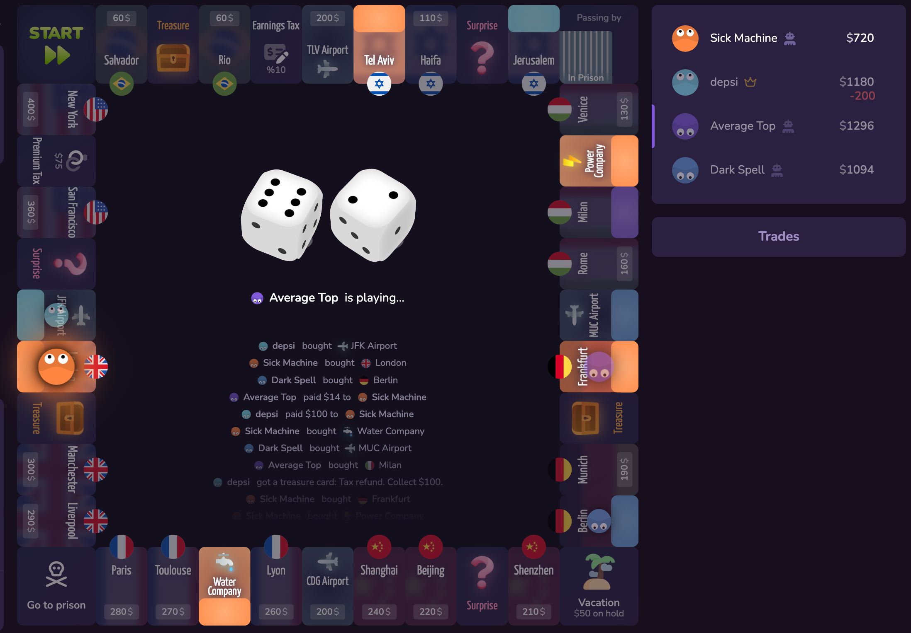

# Tasks Index

- [ ] T1: When hovering over player avatar the board should highlight the properties owned by that player. and the player position.

  

---

- [ ] T2: Vote kick player: when a player is in a game, they should be able to vote to kick another player. If the majority of players vote to kick, the player is removed from the game.

---

- [ ] T3: Forced Action Mode and 2 Types of Actions (sealed and incremental):
  - **Settings:**
    - Forced Auction: checkbox
    - Auction Mode: Sealed / Increment
  - **Forced Auction: OFF**
    - Player lands on unowned buyable property.
    - Player gets first option to buy at listed price.
    - If player buys, no auction happens.
    - If player declines, property goes to auction.
    - Landing player can still join the auction.
    - This is the classic Monopoly/Rento behavior.
  - **Forced Auction: ON**
    - Player lands on unowned buyable property.
    - Property goes directly to auction.
    - Landing player does not get exclusive buy option.
    - All eligible players can bid.
    - This is the competitive/Rento Auction Mode behavior.
  - **Auction Mode: Increment**
    - Live bidding.
    - Players bid higher than current bid.
    - Players can pass.
    - Passing is final.
    - Highest bid wins.
    - Winner pays their bid to the bank.
    - Property transfers to winner.
    - Late bids should extend the timer slightly.
    - Player can only bid what they can legally pay.
  - **Auction Mode: Sealed**
    - Every eligible player submits one hidden bid.
    - Player can submit 0 or pass.
    - Bids are revealed together.
    - Highest bid wins.
    - Winner pays their own bid.
    - If tied:
      - Landing player wins if included in the tie.
      - Otherwise next player in turn order wins.
  - **Eligible Bidders**
    - Active players can bid.
    - Jailed players can bid.
    - Bankrupt players cannot bid.
    - Disconnected players cannot place new bids.
    - Players who already passed cannot bid again.
    - Landing player can bid, even if they declined to buy.
  - **Fairness Rules**
    - Auction rules must be visible before joining the room.
    - Auction rules cannot change after the game starts.
    - Player must have enough cash to cover their bid.
    - Do not allow fake bids.
    - Auction history should be visible in game log.
    - Winning bid must be paid immediately.
    - Property is owned only after payment succeeds.
    - Same-room players should see the same auction state.
  - **Anti-Abuse Rules**
    - Do not allow host to kick players during auction.
    - Do not pause/cancel auction because one player disconnects.
    - Do not allow bidding above available cash unless mortgage-backed bidding is explicitly supported.
    - Do not allow player to pass, then re-enter.
    - Do not allow bid edits after sealed bid submission.
    - Do not reveal sealed bids before all bids are submitted or timer ends.
  - **Edge Cases**
    - Nobody bids: property stays bank-owned.
    - Only one eligible bidder: allow them to buy at minimum bid or pass.
    - Landing player declines then bids: allowed.
    - Player in jail: allowed to bid.
    - Player disconnects during auction: auto-pass if no active highest bid.
    - Highest bidder disconnects: bid remains valid; if they win, they still pay.
    - Winner cannot pay: auction win is invalid; property goes to next highest bidder or returns to bank.
    - Tie in sealed auction: landing player wins if tied, otherwise next in turn order.
    - All players pass: property stays unowned.
    - Auction starts before bankruptcy is resolved: block auction until bankruptcy/payment flow finishes.
    - Player goes bankrupt during auction: remove their bid if not winning; if winning, resolve payment/bankruptcy first.
    - Game ends during auction: finish current auction before calculating winner, unless using strict time-limit mode.
    - Bot player in auction: bot must bid using same rules as humans.
    - Mobile/network delay: server result wins, not client display.
    - Two bids arrive at same time: first accepted by server wins priority.
    - Room owner leaves: auction continues normally.

---
