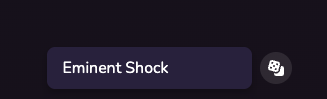
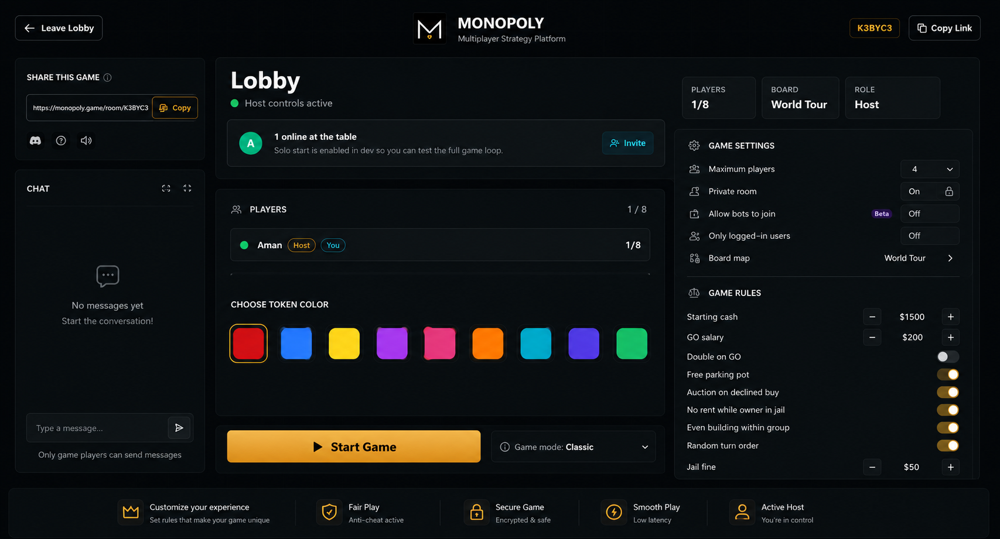

# UI tasks

- [x] T1: New landing page

  
  we want it exactly like this

- [x] T2: A dice button like richup.io that generates random names....

   

- [x] T3: Make the browse room page.... as the image is shown

    
    we want it exactly like this

- [x] T4: Make the Private room page like the refrence pic given

    
    we want it exaclty like this

- [x] T5: Make the +create private room button working refrence image is given for what it      should look like...
    when the person click the button +create private room on the page private rooms page
    this page should show up

    

- [x] T6: Make the create your own map page like the refrence

    

- [ ] T7: Remake the lobby screen...

    